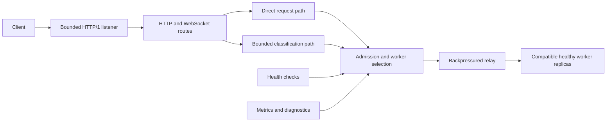

# SGLang-Omni Rust Router

`sgl-omni-router` 是 SGLang-Omni 的多线程 Rust 数据面。它在兼容的 worker 副本之间
路由 OpenAI 兼容的 chat、语音合成、转写、翻译与实时请求，并提供有界准入、
健康感知选择与带背压的流式转发。

## 概览

- 面向 Omni、TTS 与 ASR worker 的 OpenAI 兼容 HTTP 与 WebSocket 路由。
- 静态 worker 清单，显式声明模型、模态与媒体契约。
- 在兼容的健康副本上执行 `round_robin` 与 `least_requests` 路由。
- 对同构 worker 组采用直接请求流式，当路由依赖请求体时采用有界分类。
- 池化的上游 HTTP/1.1 连接，带请求 ID 传播与直接响应背压。
- 基于状态的健康检查、精确的准入与活跃请求计数、Prometheus 指标、诊断与
  优雅关停。



## 安装

### 前置条件

- **Rust 与 Cargo**

  ```bash
  # Install rustup (Rust installer and version manager)
  curl --proto '=https' --tlsv1.2 -sSf https://sh.rustup.rs | sh

  # Reload shell environment
  source "$HOME/.cargo/env"

  # Verify installation
  rustc --version
  cargo --version
  ```

- **SGLang-Omni**，按[安装指南](../get_started/installation.md)安装，用于运行
  模型 worker。

Rust 路由器从本仓库构建为一个独立的二进制文件。它把请求路由到已配置的
SGLang-Omni worker，但不会安装、启动或监管这些 worker。

### Rust 二进制

```bash
git clone https://github.com/sgl-project/sglang-omni.git
cd sglang-omni/sglang_omni_router/rust

# Build release binary
cargo build --release --locked
```

`rust-toolchain.toml` 选定受支持的 Rust 工具链。优化后的二进制文件写入
`target/release/sgl-omni-router`。

## 检查版本

安装完成后，验证安装并检查版本：

```bash
./target/release/sgl-omni-router --version
```

## 快速开始

选择与 worker 服务匹配的示例：

| 配置 | worker 服务 |
| --- | --- |
| `examples/omni.toml` | 多模态 chat，文本或音频输出 |
| `examples/tts.toml` | 语音合成，包括 PCM 流式 |
| `examples/asr.toml` | 转写与语音到英语翻译 |

示例在 `127.0.0.1:8000` 与 `127.0.0.1:8001` 定义了两个 worker。请设置
worker URL、模型 ID 与服务 profile，使其与你正在运行的进程匹配。

启动路由器之前先校验配置：

```console
./target/release/sgl-omni-router \
  --config examples/omni.toml \
  --check-config
```

启动路由器：

```console
./target/release/sgl-omni-router --config examples/omni.toml
```

等待就绪并发送一个请求：

```console
curl --fail http://127.0.0.1:30000/ready

curl --http1.1 http://127.0.0.1:30000/v1/chat/completions \
  --header 'content-type: application/json' \
  --data-binary \
  '{"model":"omni-model","messages":[{"role":"user","content":"hello"}]}'
```

## 配置

配置是严格的 UTF-8 TOML。未知字段、重复字段、缺失的必填节、不支持的 schema
版本、无效的 tracing filter 以及无效的限制都会导致校验失败。`--check-config`
只校验文件本身，不创建 Tokio runtime、不绑定监听器、不初始化 tracing、不探测
worker，也不修改进程限制。

顶层各节如下：

| 节 | 用途 |
| --- | --- |
| `server` | 监听地址、接受连接上限与请求头超时 |
| `shutdown` | 优雅排空的截止时间 |
| `logging` | 结构化日志格式与 tracing filter |
| `router` | 路由策略与可选的 voice owner |
| `admission` | 全局与按服务的在途请求上限 |
| `health` | 探测间隔、超时与状态迁移阈值 |
| `http` | 共享上游连接池与总缓冲预算 |
| `http_generation` | chat 信任域、请求限制与截止时间 |
| `http_media` | 启用的媒体路由、信任域、请求限制与截止时间 |
| `websocket` | 语音与实时路由，含建连与关闭界限 |
| `workers` | worker 身份、端点、健康路径、会话容量与服务 profile |

每个 worker 都有一个稳定的 ID、base URL、信任域、可选的默认模型、健康路径、
会话容量，以及一个或多个相关联的服务 profile。一行 profile 描述该 worker 支持的
一种组合；路由器绝不会把来自不同行的独立字段拼在一起。

DNS 的 worker 主机名在打开上游连接时解析，因此健康探测与新的数据连接会跟随
DNS 变化。worker 成员关系在进程生命周期内保持静态。

各项配置限制是部署预算。请根据预期工作负载与 worker 拓扑设置准入、连接池上限
与超时。

## 支持的 API

| 方法 | 路径 | 用途 |
| --- | --- | --- |
| `GET` | `/live` | 进程存活 |
| `GET` | `/ready` | 每个已启用服务的就绪状态 |
| `POST` | `/v1/chat/completions` | chat 与多模态生成 |
| `POST` | `/v1/audio/speech` | 编码语音或流式 PCM |
| `POST` | `/v1/audio/speech/batch` | 有序、不拆分的语音批 |
| `POST` | `/v1/audio/transcriptions` | multipart 转写 |
| `POST` | `/v1/audio/translations` | multipart 翻译 |
| `GET` | `/v1/audio/speech/stream` | 语音 WebSocket |
| `GET` | `/v1/realtime[?model=<id>]` | OpenAI 兼容实时 WebSocket |
| `GET`、`POST` | `/v1/audio/voices` | 列出或上传 worker 本地的 voice |
| `DELETE` | `/v1/audio/voices/{name}` | 删除 worker 本地的 voice |
| `GET` | `/v1/models` | 静态模型清单 |
| `GET` | `/metrics` | Prometheus 生命周期与容量指标 |
| `GET` | `/diagnostics` | 有界的路由器状态 |

生成请求使用 HTTP/1.1、JSON content type 且不带查询字符串。接受固定长度与分块
的请求体。单个 `Expect: 100-continue` 由客户端连接处理，不转发上游。有歧义的
组帧、trailer、其他 expectation、不支持的内容编码以及超大的上传都会在派发之前
被拒绝。

每个请求由一个规范的 `x-request-id` 标识。调用方提供的合法值会被保留；否则由
路由器生成。同一个值既发送给 worker，也返回给客户端。

## 路由与转发

### 请求路径

当信任域内 cohort 中每个合格副本都拥有相同的具体默认模型与兼容的 profile
契约时，直接路径可用。异构池使用分类路径。可选的 `x-sglang-omni-route-model`
与 `x-sglang-omni-route-stream` 头会与分类后的请求体核对，且不转发上游。路由器
以带背压的流转发直接请求体。

需要从请求体获取路由事实的请求会预留总字节容量，读取一次请求体，并对模型、
内容形态、媒体位置、输入输出模态、响应格式与流式模式做分类。分类在 Tokio 的
blocking pool 上运行，执行受可用 CPU 并行度限制，而总缓冲字节预算约束并发
分类器的内存。原始字节原样转发，不重建 JSON 或 multipart 内容。

直接路径受各路由的 `streamed_request_max_bytes` 限制。分类路径受各路由的
`buffered_request_max_bytes`（每请求）与 `http.buffered_request_total_bytes`
（chat 与媒体请求合计）限制。它们的默认值分别是 512 MiB、8 MiB 与 256 MiB。
分块的分类请求在字节到达时获取共享预算。未显式指定模型的请求在兼容 worker
不共享同一个默认值时返回 `ambiguous_model`。分类的 JSON 遵循标准 JSON 数字
语法；非标准的 `NaN` 与 `Infinity` token 会被拒绝。

分类在 worker 选择之前完成，因此分类不占用上游连接。

### worker 选择

`round_robin` 在兼容的健康副本之间轮转。`least_requests` 比较活跃请求数，并在
打平时轮转。选择操作在派发之前增加所选 worker 的负载，并且在持有策略锁期间
不做任何网络或请求体工作。

路由策略与具体工作负载相关。请在目标并发下用全量语料测量，在受支持的策略之间
做出选择。

### 准入与背压

全局准入按请求信封计数。按服务的准入按请求或会话计数，speech-batch 准入除外
——它按批条目计数。准入是 fail-fast 的，其许可与 worker 负载守卫会一直保持到
响应 EOF、上游错误或下游取消为止。worker 仍然对自身的执行与队列容量负责。

路由器通过共享的 HTTP/1.1 连接池发送一个上游请求。重定向、环境代理、重试与
自动解压均已禁用。请求与响应体使用直接背压，没有 body pump、应用队列或额外的
转发任务。

请求截止时间覆盖上传、连接建立与上游响应头。在上传完成之前收到的最终 worker
响应会作为上游协议错误被拒绝，不会提交到下游。响应头提交之后，响应没有总的
墙钟时间限制。

响应仍会在上游 EOF 或错误、下游断开或进程排空时正常结束。

## 媒体与实时会话

媒体路由独立启用。语音批保持有序且绝不拆分。分类的转写与翻译请求会缓冲完整的
multipart 上传，因此异构 ASR 部署必须按其接受的最大录音尺寸设置缓冲限制。
转写与翻译共享一个容量类别，但需要独立的 profile 任务。

路由器原样保留受信 worker 的响应 content type，以及 JSON、文本、SSE、编码
音频、原始 PCM、采样率与声道元数据、usage、completion-token 与 finish-reason
契约。它不解码、转码或重新生成音频。

语音与实时 WebSocket 会终结两端握手，并为整个会话固定一个 worker。每一帧都
等待其目的端发送完成，保持帧类型与顺序，没有转发任务或应用队列。两条链路都
使用 16 MiB 的消息上限。语音配置、上游传输建立、第一个 worker 事件与关闭收敛
使用各自的截止时间。应用层的空闲行为仍由 worker 负责。realtime 的 `model`
查询参数要求一个默认值与之匹配的 worker；省略 model 时可使用信任域内任何兼容
的 worker。`worker_setup_timeout_ms` 是针对 worker 初始应用事件的操作安全
界限；它到期不会限制会话生命周期，也不会把 worker 标记为不健康。语音配置按
字节逐字重放；路由器只提取路由事实，协议取值的校验由 worker 负责。

上传的 voice 有一个由 `router.voice_owner_worker_id` 配置的显式 owner。voice
的 CRUD 与使用上传名称的请求固定到该 worker。预置名称与显式引用继续使用正常的
worker 选择。路由器不存储、复制或同步 worker 本地的 voice 数据。
`voice_name_policy = "preset"` 声明名称由服务中的模型提供。
`voice_name_policy = "uploaded"` 声明名称从 worker 本地的 voice 状态解析；
混合流水线应使用 `uploaded`，使命名请求的路由更保守。当其他方面兼容的
profile 在该策略上不一致时，命名 voice 的请求会被拒绝。Qwen3-TTS
CustomVoice 的 profile 使用 `preset`；Qwen3-TTS Base、Higgs 以及混合 dots
风格的 profile 使用 `uploaded`。

## 健康与就绪

worker 以未知的健康状态启动。每个 worker 有一个串行探测循环，应用配置的连续
成功与失败阈值。传输与上游协议失败可以请求一次立即的合并探测。应用响应不会
直接改变 worker 健康状态。

`GET /ready` 在进程正在服务、且每个已启用的生成、媒体与 WebSocket 服务都有
兼容的健康 worker 时返回 `200`。就绪还要求配置的上传 voice owner 健康且兼容。
当前 worker 负载不改变就绪状态。

## 运维

`/v1/models` 返回根据 worker 默认值与相关 profile 模型 ID 构建的、排序去重的
清单。`/metrics` 暴露 Prometheus 的生命周期、就绪、健康、准入、worker 负载、
监听器、缓冲字节、分类槽位与 WebSocket 会话 gauge。它还暴露累计的请求与响应头
计数、路由器生成的故障、饱和拒绝、worker 探测结果、分类结果、WebSocket 终止
原因，以及已提交的 HTTP 响应体结果。

响应头直方图从进入路由器边界开始测量，直到有可用的 HTTP 响应为止。它不测量
响应体完成、流式 TTFT 或 WebSocket 会话时长。在该边界之前被取消的请求单独
计数。分类直方图为每种请求类型分别记录槽位等待、blocking executor 等待与执行
时长。比调用方超时或取消存活更久的阻塞工作，在其开始或结束时记录各阶段时长，
而不改变调用方的最终结果。WebSocket 终止计数器区分建连阶段与活跃转发阶段，
并为每个升级后的会话记录一个有界的终止原因。它们不测量有界关闭握手的完成
情况。HTTP 响应体计数器区分完整响应体、上游响应体错误与未完成即丢弃的响应体。
提交后转发失败计数器是上游错误的一个子集。`/diagnostics` 返回同一路由器本地
状态的有界确定性 JSON，并标记配置的 voice owner。每个诊断中的 worker 包含
固定服务类别与 voice 控制操作的累计派发计数。一个语音批在活跃期间贡献一次
派发，而 worker 负载仍按条目加权。worker 还包含其最近一次探测结果、存在时的
HTTP 状态、观测时间、状态迁移连击与累计结果。

运维响应只对路由器本地状态做快照，绝不联系 worker。准入值来自执行路由器限制
的信号量。worker 负载来自 `least_requests` 使用的同一计数器。指标标签使用固定
词表，而不是 worker ID、模型 ID、请求 ID、路径或客户端输入。监听器使用量包含
pending accept 占用的槽位。已注册的 WebSocket 会话表示为关停保留的回调。

结构化日志覆盖生命周期事件、健康状态迁移与异常状况。`logging.filter` 接受
tracing filter 表达式，`logging.format` 接受 `json` 或 `compact`。

## 网络与关停

`server.max_connections` 约束已接受的客户端 socket 数量。监听器在 `accept`
之前获取容量，已接受的传输从 HTTP 升级开始持有该许可，直到 socket 关闭。
已接受的 socket 启用 `TCP_NODELAY`。

`server.header_read_timeout_ms` 限制每个初始或 keep-alive 的 HTTP/1 请求头。
它不限制请求体、活跃 handler、响应、流或升级后的传输。连接级 accept 错误立即
重试；其他 accept 错误记录日志并在一秒后重试。

在 Unix 上，启动时会尝试把 `RLIMIT_NOFILE` 软上限提高到 `65,535`。如果进程
的硬上限不允许，路由器记录警告并继续。请按部署所配置的连接与准入并发设置进程
文件上限。

第一个 `SIGINT` 或 `SIGTERM` 会关闭准入、停止健康工作、丢弃监听器并排空自有
任务。再收到一个不同的信号或排空截止时间到达时，中止并 join 剩余工作，然后以
失败退出。

## 安全与部署

路由器使用一个静态清单与一个多线程进程。它支持数值形式的 loopback 与非
loopback 监听地址、Linux 主机与容器，以及不需要 Python 控制面/数据面分离的
MPS 数据并行 worker 部署。

路由器不实现客户端认证，也不终结 TLS。请把它部署在可信网络中，或放在带认证
的 TLS 代理后面。

动态 worker 发现与 CRUD、请求重试、熔断器、缓存感知路由、prefill/decode 路由
以及 worker 监管都不在本路由器数据面契约的范围内。

## 开发

### 工具链

安装固定的实现工具链与最低支持的 Rust 版本：

```console
rustup toolchain install 1.97.1 \
  --profile minimal \
  --component clippy,rustfmt
rustup toolchain install 1.90.0 --profile minimal
```

`rust-toolchain.toml` 为常规命令选择 Rust 1.97.1。Rust 1.90.0 只用于兼容性
检查。

### 共享构建缓存

Cargo 默认把构建产物写入 `target/`。使用多个 Git worktree 的开发者可以共享
一个构建目录：

```console
export CARGO_TARGET_DIR="${XDG_CACHE_HOME:-$HOME/.cache}/sglang-omni-router/target"
```

Cargo 会协调对共享目录的并发访问。不同的工具链、profile、target 与 feature 集
保持独立的指纹。当设置了 `CARGO_TARGET_DIR` 时，Cargo 把二进制写入
`$CARGO_TARGET_DIR/release/sgl-omni-router`。

### 质量门禁

运行与 CI 相同的检查：

```console
cargo fmt --all -- --check
cargo +1.90.0 check --workspace --all-targets --all-features --locked
cargo clippy --workspace --all-targets --all-features --locked -- -D warnings
cargo test --workspace --all-targets --all-features --locked -- --test-threads=1
RUSTDOCFLAGS="-D warnings" \
  cargo doc --workspace --all-features --no-deps --locked
cargo build --release --workspace --all-features --locked
```

用 release 二进制校验所有纳入版本管理的部署示例：

```console
binary="${CARGO_TARGET_DIR:-./target}/release/sgl-omni-router"
git ls-files -- 'examples/*.toml' | LC_ALL=C sort | while IFS= read -r config; do
  "$binary" --config "$config" --check-config
done
```

单元测试紧邻其测试的实现代码。进程、HTTP、媒体、WebSocket 与 voice 的集成测试
位于 `tests/` 下，并在传输行为属于契约一部分时使用真实的 loopback socket。

### 源码布局

| 路径 | 职责 |
| --- | --- |
| `src/config.rs` | 严格配置与跨字段校验 |
| `src/server.rs` | runtime 组装、路由、监听器与关停 |
| `src/worker_pool/` | 准入、健康、profile、策略选择与 worker 负载 |
| `src/http_relay/` | 共享 HTTP 客户端、缓冲、body 适配器与转发 |
| `src/http_generation/` | chat 校验与分类 |
| `src/http_media/` | 语音、批、转写、翻译与 voice |
| `src/websocket/` | 语音与实时会话的建立及转发 |
| `src/operations.rs` | 模型、指标与诊断 |
| `tests/` | 进程与协议集成测试 |

## Python Router

Python 路由器仍以 `sgl-omni-router-py` 提供。其指南为
`docs/basic_usage/python_router.md`。
