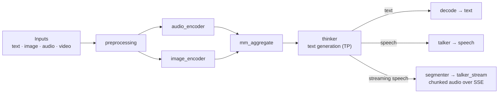

# Ming-Omni

[Ming-flash-omni-2.0](https://huggingface.co/inclusionAI/Ming-flash-omni-2.0) 是一个多模态全能模型，接受文本、图像、音频和视频输入，并可通过 SGLang-Omni 的 OpenAI 兼容 `/v1/chat/completions` 端点返回文本或文本 + 音频。在 SGLang-Omni 中，Ming 以多阶段流水线的形式提供服务：媒体预处理与编码器准备多模态嵌入，thinker 生成文本，talker 将响应文本转换为 44.1 kHz 语音。

对于 Ming，请从 `sgl-omni serve` 入手。通用 OmniServe 入口现在能够根据模型路径构建 Ming 文本与语音流水线，因此下面的命令是面向客户的启动路径。对于同样适用于 Qwen3-Omni 的通用聊天请求字段，请参见 [Qwen3-Omni](./qwen3_omni.md)。

## 前置条件

按照[安装](../get_started/installation.md)的说明安装 `sglang-omni`，然后确保 Ming checkpoint 可用：

```bash
hf download inclusionAI/Ming-flash-omni-2.0
```

语音路径要求 checkpoint 包含 `talker/` 资产，包括 `talker/data/voice_name.json` 和 `talker/vae/`。当前 Ming 语音流水线中的默认音色是 `DB30`。`campplus.onnx` 和 `talker_tn` 是可选的运行时辅助组件：缺少 `campplus.onnx` 会禁用说话人嵌入提取，缺少 `talker_tn` 则回退到恒等文本归一化。

HF 上的 `Ming-flash-omni-2.0` 不附带顶层 thinker tokenizer 文件。`load_ming_tokenizer` 会回退到 `inclusionAI/Ming-flash-omni-Preview`（约 12 MB）来复制 `tokenizer.json`、`tokenizer_config.json` 和 `special_tokens_map.json`。在离线环境中，请同时下载这些文件：

```bash
hf download inclusionAI/Ming-flash-omni-Preview tokenizer.json tokenizer_config.json special_tokens_map.json
```

Ming-flash-omni-2.0 是一个大型 MoE 模型。在实际服务中，请对 thinker 使用张量并行。下面的示例使用 `CUDA_VISIBLE_DEVICES` 之内的逻辑 GPU id；当 `CUDA_VISIBLE_DEVICES=0,1,2,3,4` 时，`--thinker.gpu "[0, 1, 2, 3]"` 表示 thinker 使用前四个可见 GPU，而 `--talker.gpu 4` 使用第五个可见 GPU。

## 架构



媒体预处理与音频/图像编码器准备多模态嵌入，`mm_aggregate` 对其进行融合，thinker 生成响应文本，终端阶段决定输出：`decode` 输出文本，`talker` 输出整句语音，`segmenter -> talker_stream` 输出分块流式音频。

Ming 有三种服务变体：

| 变体 | 流水线 | 输出 | 入口 |
|---|---|---|---|
| 文本 | `preprocessing -> audio_encoder + image_encoder -> mm_aggregate -> thinker -> decode` | 文本 | `sgl-omni serve --text-only` |
| 语音 | 文本流水线加上 `talker` 终端阶段 | 文本 + 音频 | `sgl-omni serve` |
| 流式语音 | 带 `segmenter -> talker_stream` 的语音流水线 | 文本 + 通过 SSE 传输的分块音频 | `MingOmniStreamingSpeechPipelineConfig` 流水线配置 |

当你只传入 `--model-path` 时，OmniServe 会选择默认的 Ming 语音流水线。当你只需要文本输出并希望避免启动 talker 时，请添加 `--text-only`。流式语音是一个单独的 Ming 流水线变体；基准测试部分包含流式证据，但本 cookbook 中现成的复制粘贴命令聚焦于通用的模型路径文本与语音路径。

路由器（如果使用）会将整个请求路由到完整的 Ming worker。它不会将一个请求拆分到不同 worker 的 thinker 和 talker 上。

## 服务器配置

使用下面的选择器为你的配置生成精确的启动命令。选择输出**模式**（仅文本或文本 + 音频）、**Thinker TP** 并行度、图像编码器可选的 **Vision TP** 并行度，以及**硬件**档位。GPU 分配互不重叠 —— 先分配 thinker，然后是 talker（语音模式），再是视觉编码器的 rank —— 并且 `CUDA_VISIBLE_DEVICES` 前缀的长度与之匹配。

```{raw} html
<div id="sgl-ming-server-gen-mount"></div>
```

`--text-only` 选择仅含 thinker 的流水线（无 talker、无音频）。语音流水线则省略该参数，并会添加一个专用的 `--talker.gpu`。talker GPU 不得与 thinker TP 放置重叠（这是 Ming 唯一会校验的放置项），因此生成器总是将其保持独立。视觉编码器默认与 thinker 一起使用 GPU 0，因此其 TP rank 既可以共享 thinker 的 GPU（**与 thinker 共用**，默认），也可以使用专用 GPU。

**硬件**开关用于设置 `--mem-fraction-static`：

| 档位 | 显存 | `--mem-fraction-static` | 原因 |
|---|---|---|---|
| H100 | 80 GB | `0.80` | 基线；权重加上一个较小的 KV 池在 0.80 下可以放下。 |
| H200 | 141 GB | `0.90` | MoE 权重占用的绝对空间大致相同，但空闲比例更大，因此需要更高的比例才能让静态预算覆盖权重并为 KV 池留出空间；TP=2 时 `0.80` 可能 OOM，因为预留的池会太小。 |

其他大显存机型（例如 H20-3e 144 GB）的表现与 H200 类似 —— 从 `0.9` 开始。如果你的机器不借助 CPU 卸载就无法容纳 thinker，请移除 `--cpu-offload-gb 0`，让启动器使用其默认卸载设置（更容易放下，但会降低吞吐量）。

如需一个使用 OmniServe 默认放置的较小规模冒烟运行：

```bash
sgl-omni serve \
  --model-path inclusionAI/Ming-flash-omni-2.0 \
  --model-name ming-omni \
  --port 8000
```

这条冒烟命令会启动默认的具备语音能力的 Ming 流水线。如果冒烟运行应跳过 talker，请添加 `--text-only`。

(vision-encoder-tensor-parallelism)=
### 视觉编码器张量并行

Ming 图像（视觉）编码器使用与 thinker 相同的点分拼写跨 GPU 分片：`--image_encoder.tp_size` 和 `--image_encoder.gpu`。`--image_encoder.gpu` 接受一个 JSON 列表，每个 TP rank 对应一个 GPU id（`"[4, 5]"`）；其数量必须等于 `--image_encoder.tp_size`。该编码器有 16 个注意力头，因此 TP=2 和 TP=4 都能均匀分片。当你调高 **Vision TP** 时，上面的选择器会自动填入这些参数。TP=1（单 GPU）是默认值 —— 只有当视觉编码器成为图像/视频工作负载的吞吐量瓶颈时，分片才有帮助。

默认情况下，编码器与 thinker 一起在 GPU 0 上运行，因此其 TP rank 可以复用 thinker 的 GPU（**视觉 GPU：与 thinker 共用**），无需额外硬件，这在 Vision TP ≤ Thinker TP 时有效。当 thinker 的 GPU 受显存限制时，可选择**专用**，将 rank 放在它们自己的 GPU 上。

### 流式语音客户端

当首音频延迟比最大总吞吐量更重要时，请使用流式语音流水线。请求结构与语音路径的 OpenAI 兼容 chat-completions 结构相同，带有 `"stream": true`，音频分块会通过 `choices[0].delta.audio.data` 到达。

通用的 `sgl-omni serve --model-path` 命令目前直接提供默认语音流水线和 `--text-only` 变体。流式语音使用 `MingOmniStreamingSpeechPipelineConfig` 流水线配置。在 cookbook 之外提供公开的 Ming 流式配置之前，请将下面的流式数据视为 PR/本地补丁证据，并使用上面的非流式语音命令作为受支持的复制粘贴启动方式。

流式流水线面向音频分块。仅文本的 `stream=true` 路径目前会输出一个聚合文本块，而不是逐 token 的文本增量。

### 放置与内存说明

使用 `--thinker.tp_size` 设置 thinker 张量并行，使用 `--thinker.gpu` 以 JSON 列表形式选择逻辑 GPU id。`--thinker.engine.cpu_offload_gb`、`--thinker.engine.quantization` 以及广播参数 `--mem-fraction-static` 会被转发给 thinker 服务器。`--talker.gpu` 仅用于语音流水线，并且要与 thinker 的 GPU 分开。使用 `--image_encoder.tp_size` / `--image_encoder.gpu` 进行图像编码器张量并行。上面的选择器会一致地配置所有这些放置。

## 输入与输出示例

### 文本输入，文本输出

```bash
curl -X POST http://localhost:8000/v1/chat/completions \
  -H "Content-Type: application/json" \
  -d '{
    "model": "ming-omni",
    "messages": [{"role": "user", "content": "Explain what tensor parallelism is in one sentence."}],
    "modalities": ["text"],
    "max_tokens": 128,
    "temperature": 0.0
  }'
```

Python：

```python
import requests

resp = requests.post(
    "http://localhost:8000/v1/chat/completions",
    json={
        "model": "ming-omni",
        "messages": [{"role": "user", "content": "Explain what tensor parallelism is in one sentence."}],
        "modalities": ["text"],
        "max_tokens": 128,
        "temperature": 0.0,
    },
)
resp.raise_for_status()
print(resp.json()["choices"][0]["message"]["content"])
```

输出（仅文本 TP4 服务器，`temperature: 0.0`）：

```text
Tensor parallelism is a technique used in distributed computing to split large tensors across multiple devices, allowing for parallel computation and efficient processing of large-scale machine learning models.
```

### 图像与文本输入

支持顶层 `images` 字段。预处理器会将它们注入第一条用户消息，并保持媒体缓存键相互独立，从而避免多模态占位符在前缀缓存中发生混叠。

```bash
curl -X POST http://localhost:8000/v1/chat/completions \
  -H "Content-Type: application/json" \
  -d '{
    "model": "ming-omni",
    "messages": [{"role": "user", "content": "Describe this image in one sentence."}],
    "images": ["https://qianwen-res.oss-cn-beijing.aliyuncs.com/Qwen-VL/assets/demo.jpeg"],
    "modalities": ["text"],
    "max_tokens": 64,
    "temperature": 0.0
  }'
```

Python：

```python
import requests

resp = requests.post(
    "http://localhost:8000/v1/chat/completions",
    json={
        "model": "ming-omni",
        "messages": [{"role": "user", "content": "Describe this image in one sentence."}],
        "images": ["https://qianwen-res.oss-cn-beijing.aliyuncs.com/Qwen-VL/assets/demo.jpeg"],
        "modalities": ["text"],
        "max_tokens": 64,
        "temperature": 0.0,
    },
)
resp.raise_for_status()
print(resp.json()["choices"][0]["message"]["content"])
```

输出（女士与狗的海滩图片，`temperature: 0.0`）：

```text
A woman and her dog are sitting on the beach, sharing a high-five as the sun sets in the background.
```

### 音频与图像输入

同时提供 `images` 和 `audios`；文本提示可以引导模型分别关注二者：

```bash
curl -X POST http://localhost:8000/v1/chat/completions \
  -H "Content-Type: application/json" \
  -d '{
    "model": "ming-omni",
    "messages": [{"role": "user", "content": "What is said in the audio, and what is shown in the image?"}],
    "images": ["https://qianwen-res.oss-cn-beijing.aliyuncs.com/Qwen-VL/assets/demo.jpeg"],
    "audios": ["https://huggingface.co/datasets/zhaochenyang20/seed-tts-eval-mini/resolve/main/en/prompt-wavs/common_voice_en_10119832.wav"],
    "modalities": ["text"],
    "max_tokens": 64,
    "temperature": 0.0
  }'
```

Python：

```python
import requests

resp = requests.post(
    "http://localhost:8000/v1/chat/completions",
    json={
        "model": "ming-omni",
        "messages": [{"role": "user", "content": "What is said in the audio, and what is shown in the image?"}],
        "images": ["https://qianwen-res.oss-cn-beijing.aliyuncs.com/Qwen-VL/assets/demo.jpeg"],
        "audios": ["https://huggingface.co/datasets/zhaochenyang20/seed-tts-eval-mini/resolve/main/en/prompt-wavs/common_voice_en_10119832.wav"],
        "modalities": ["text"],
        "max_tokens": 64,
        "temperature": 0.0,
    },
)
resp.raise_for_status()
print(resp.json()["choices"][0]["message"]["content"])
```

输出（英文语音样本加海滩图片；在 `max_tokens: 64` 处截断）：

```text
The audio clip features a woman's voice, while the image depicts a woman and a dog on a beach. The woman in the image is sitting on the sand, facing the dog, and appears to be interacting with it. The dog is sitting upright, looking at the woman, and seems to be engaged in the interaction
```

### 视频输入

视频文件使用相同的顶层请求风格。限制帧数或像素预算以获得可预测的延迟：

```bash
curl -X POST http://localhost:8000/v1/chat/completions \
  -H "Content-Type: application/json" \
  -d '{
    "model": "ming-omni",
    "messages": [{"role": "user", "content": "Describe the action in this video."}],
    "videos": ["https://qianwen-res.oss-cn-beijing.aliyuncs.com/Qwen2-VL/space_woaudio.mp4"],
    "video_max_frames": 16,
    "modalities": ["text"],
    "max_tokens": 96,
    "temperature": 0.0
  }'
```

Python：

```python
import requests

resp = requests.post(
    "http://localhost:8000/v1/chat/completions",
    json={
        "model": "ming-omni",
        "messages": [{"role": "user", "content": "Describe the action in this video."}],
        "videos": ["https://qianwen-res.oss-cn-beijing.aliyuncs.com/Qwen2-VL/space_woaudio.mp4"],
        "video_max_frames": 16,
        "modalities": ["text"],
        "max_tokens": 96,
        "temperature": 0.0,
    },
)
resp.raise_for_status()
print(resp.json()["choices"][0]["message"]["content"])
```

输出（空间站内两名宇航员的短片，`temperature: 0.0`）：

```text
The video shows two astronauts inside a space station. One astronaut is holding a microphone and speaking, while the other is standing with his arms crossed. The background includes various equipment and a laptop.
```

### 文本输入，文本 + 音频输出

先启动语音服务器（上面的 `Text + Audio Output` 命令），然后使用 `modalities: ["text", "audio"]` 请求音频。语音回复以 base64 WAV 的形式返回在 `choices[0].message.audio.data` 中。

```bash
curl -s -X POST http://localhost:8000/v1/chat/completions \
  -H "Content-Type: application/json" \
  -d '{
    "model": "ming-omni",
    "messages": [{"role": "user", "content": "Read this sentence aloud: This model understands text, images, audio, and video, and can reply with either text or speech."}],
    "modalities": ["text", "audio"],
    "audio": {"format": "wav"},
    "max_tokens": 64,
    "temperature": 0.0
  }' \
  | python3 -c 'import sys, json, base64; m = json.load(sys.stdin)["choices"][0]["message"]; print(m.get("content", "")); open("ming_output.wav", "wb").write(base64.b64decode(m["audio"]["data"]))'
```

Python：

```python
import base64
import requests

resp = requests.post(
    "http://localhost:8000/v1/chat/completions",
    json={
        "model": "ming-omni",
        "messages": [{"role": "user", "content": "Read this sentence aloud: This model understands text, images, audio, and video, and can reply with either text or speech."}],
        "modalities": ["text", "audio"],
        "audio": {"format": "wav"},
        "max_tokens": 64,
        "temperature": 0.0,
    },
)
resp.raise_for_status()
message = resp.json()["choices"][0]["message"]
print(message.get("content", ""))

audio = base64.b64decode(message["audio"]["data"])
with open("ming_output.wav", "wb") as f:
    f.write(audio)
```

输出（语音服务器，`temperature: 0.0`）：

```text
This model understands text, images, audio, and video, and can reply with either text or speech.
```

`ming_output.wav` 是一个单声道 WAV 文件，承载 talker 的 44.1 kHz 语音（这个约 8 秒的回复约 700 KB）。

参考输出：

<audio controls>
  <source src="../_static/audio/ming-omni-intro.wav" type="audio/wav">
</audio>

### 流式语音

使用流式语音服务器时，设置 `"stream": true` 并消费 Server-Sent Events。音频分块会通过 `choices[0].delta.audio.data` 到达。要用 curl 查看原始 SSE 流（使用 `-N` 禁用缓冲）：

```bash
curl -N -X POST http://localhost:8000/v1/chat/completions \
  -H "Content-Type: application/json" \
  -d '{
    "model": "ming-omni",
    "messages": [{"role": "user", "content": "Say one friendly sentence."}],
    "modalities": ["text", "audio"],
    "audio": {"format": "wav"},
    "stream": true,
    "max_tokens": 64,
    "temperature": 0.0
  }'
```

Python（解码并写入每个音频分块）：

```python
import base64
import json
from pathlib import Path

import requests

chunk_paths: list[Path] = []

with requests.post(
    "http://localhost:8000/v1/chat/completions",
    json={
        "model": "ming-omni",
        "messages": [{"role": "user", "content": "Say one friendly sentence."}],
        "modalities": ["text", "audio"],
        "audio": {"format": "wav"},
        "stream": True,
        "max_tokens": 64,
        "temperature": 0.0,
    },
    stream=True,
    timeout=600,
) as resp:
    resp.raise_for_status()
    for line in resp.iter_lines(decode_unicode=True):
        if not line or not line.startswith("data: "):
            continue
        data = line.removeprefix("data: ")
        if data == "[DONE]":
            break
        event = json.loads(data)
        delta = event["choices"][0].get("delta", {})
        if delta.get("content"):
            print(delta["content"], end="", flush=True)
        audio = delta.get("audio") or {}
        if audio.get("data"):
            chunk = base64.b64decode(audio["data"])
            chunk_path = Path(f"ming_stream_chunk_{len(chunk_paths):03d}.wav")
            chunk_path.write_bytes(chunk)
            chunk_paths.append(chunk_path)
```

该示例将每个音频分块写入单独的 WAV 文件。如果你想要一个可播放的文件，请解析每个 WAV 分块并使用标准音频库拼接 PCM 帧。

输出：使用流式语音流水线时，音频以多个 `delta.audio.data` 分块到达。而针对**非流式**语音服务器（`Text + Audio Output` 命令），`stream: true` 仍然返回有效的 SSE，但音频会在生成完成后作为单个聚合块返回 —— 例如一个携带 `Hello! How can I assist you today?` 的文本增量、一个约 276 KB 的聚合 WAV 块，以及在 `[DONE]` 之前的最后一个 `finish_reason: stop` 事件：

```text
Hello! How can I assist you today?
```

流式 WAV 分块承载与非流式回复相同的 44.1 kHz 语音。

## 请求参数

| 参数 | 默认值 | 说明 |
|---|---|---|
| `model` | `null` | 使用启动时的 `--model-name` 值，通常是 `ming-omni`。 |
| `messages` | 必填 | OpenAI 风格的聊天消息。content 可以是字符串，也可以是带类型的媒体片段列表。 |
| `modalities` | `["text"]` | 文本输出使用 `["text"]`，语音输出使用 `["text", "audio"]`。 |
| `images` | `null` | 本地路径或 URL 列表。 |
| `audios` | `null` | 本地路径或 URL 列表。音频以 16 kHz 加载，供 Whisper 风格的音频编码器使用。 |
| `videos` | `null` | 本地路径或 URL 列表。 |
| `video_fps` | `null` | 可选的帧采样率。 |
| `video_max_frames` | `null` | 可选的采样帧数上限。 |
| `video_min_pixels` | `null` | 传递给视频预处理的最小每帧像素预算。 |
| `video_max_pixels` | `null` | 传递给视频预处理的最大每帧像素预算。 |
| `video_total_pixels` | `null` | 采样帧的总像素预算。 |
| `max_tokens` | `2048` | 作为 `max_new_tokens` 转发给 Ming。 |
| `temperature` | `1.0` | chat-completions 默认值。为获得确定性的贪心示例，请设置为 0.0。 |
| `top_p` | `1.0` | Thinker 采样。 |
| `top_k` | `-1` | Thinker 采样。 |
| `min_p` | `0.0` | Thinker 采样。 |
| `repetition_penalty` | `1.0` | Thinker 采样。 |
| `stop` | `[]` | 停止字符串或停止字符串列表。 |
| `seed` | `null` | 作为 `sampling_seed` 转发。 |
| `stream` | `false` | 与流式语音流水线一起使用以获取音频分块。 |
| `audio.format` | `wav` | chat-completions 音频格式。 |
| `stage_params` | `null` | 高级逐阶段参数。 |

## 基准测试结果

下面的数字是 SGLang-Omni 在匹配的提示、采样设置和解码参数下服务 Ming-flash-omni-2.0 的 H100 级别方向性服务证据。它们有助于设定预期，并非普遍保证；引用这些数字时请连同注意事项一起引用。

### 文本 Thinker（GSM8K）

纯文本 thinker 路径，仅文本输出，来自 GSM8K `main` 测试拆分的 100 个样本（1319 道题中的前 100 道，确定的文件顺序），贪心（T=0），TP=4 thinker。

| 并发数 | 吞吐量 | 平均延迟 | 准确率 |
|---:|---:|---:|---:|
| 1 | `0.615 qps` | `1.63 s` | 94% |
| 4 | `1.938 qps` | `2.06 s` | 95% |
| 16 | `4.608 qps` | `3.26 s` | 95% |

在准确率稳定的情况下，吞吐量从 c=1 到 c=16 近似线性扩展（约 7.5×）。

### 图文（MMMU）

图文输入，文本输出，来自完整 `MMMU/MMMU` `validation` 拆分的 50 个样本（全部 30 个科目，按样本 id 排序，前 50 个带图像的样本 —— 不是 `zhaochenyang20/mmmu-ci-50` CI 子集），贪心（T=0），TP=4 thinker。

| 并发数 | 吞吐量 | 平均延迟 | 中位延迟 | 准确率 |
|---:|---:|---:|---:|---:|
| 1 | `0.144 qps` | `6.70 s` | `3.48 s` | 60% |
| 2 | `0.251 qps` | `7.69 s` | `4.35 s` | 64% |
| 4 | `0.454 qps` | `8.47 s` | `4.89 s` | 66% |
| 8 | `0.720 qps` | `10.47 s` | `6.25 s` | 64% |
| 16 | `0.996 qps` | `14.16 s` | `8.92 s` | 62% |

吞吐量从 c=1 到 c=16 扩展约 6.9×；准确率保持在 MMMU 样本噪声范围内。

### 非流式 Talker

语音输出（`modalities=["text","audio"]`），音色 `DB30`，统一提示，TP=4 thinker + 专用 talker GPU。测量基于 `stream=false` 的 7 阶段非流式 `MingOmniSpeechPipelineConfig`（而非流式流水线）；每个请求都返回了真实的 44.1 kHz 音频（`n_fail=0`，平均约 6.3 s/条）。

| 并发数 | 吞吐量 | 平均墙钟时间 | p95 墙钟时间 |
|---:|---:|---:|---:|
| 1 | `2.02 req/s` | `0.493 s` | `0.522 s` |
| 2 | `2.87 req/s` | `0.68 s` | `0.74 s` |
| 4 | `3.01 req/s` | `1.25 s` | `1.39 s` |
| 8 | `2.92 req/s` | `2.35 s` | `2.77 s` |
| 16 | `3.03 req/s` | `3.70 s` | `5.01 s` |

talker 是单流的（`SimpleScheduler.max_concurrency=1`），这使得 CFM CUDA graph 捕获成为可能，并保持 c=1 延迟较低。在高并发下，吞吐量在 `3 req/s` 附近达到平台期。

### 流式 Talker

流式语音是一条低并发的 UX 路径：它以一部分吞吐量为代价换取大幅提前的首音频。后端相同，音色同为 `DB30`。首音频在流式下指首个音频分块时间（TTFA），在非流式下指完整响应的墙钟时间。

| 并发数 | 流式 TTFA | 非流式首音频 | 流式吞吐量 | 非流式吞吐量 |
|---:|---:|---:|---:|---:|
| 1 | `0.236 s` | `0.509 s` | `1.206 req/s` | `1.956 req/s` |
| 2 | `0.593 s` | `0.653 s` | `1.288 req/s` | `2.989 req/s` |
| 4 | `1.269 s` | `1.260 s` | `1.368 req/s` | `2.990 req/s` |
| 8 | `2.675 s` | `2.280 s` | `1.410 req/s` | `3.006 req/s` |
| 16 | `4.474 s` | `3.697 s` | `1.448 req/s` | `3.011 req/s` |

在 c=1 时，流式以约 38% 的吞吐量代价提前约 2.2× 交付首音频。交叉点在 c≈4 附近；超过之后，单流排队会使流式的第一个分块比非流式的完整响应更晚到达。每个流式请求以约 19 ms 的间隔输出约 20 个分块。流式测量数据来自 PR/本地补丁证据，并非面向整个版本的保证；引用流式时应将其表述为低并发下的首音频收益，而非普遍的吞吐量收益。

### 音频等价性

一项小规模 c=1 审计（单一提示、单一音色、每种模式 n=4 个 WAV）验证了在同一后端上流式路径相对于非流式保留了音频内容。

| 对比 | 结果 |
|---|---|
| 流式与非流式 | 可懂度等价：二者 CER 均为 0/0，跨模式 mel-L2 约为模式内基线的 1.5 倍，时长差异 <3%。 |

可懂度得到完全保留；流式与非流式接近但并非逐位一致（这是分块解码开窗的预期结果）。

## 已知限制

- **Ming 很大。** 请使用 thinker TP 并有意识地规划 GPU 放置。在 80 GB H100 级别的 GPU 上，MoE thinker 无法装入单个 GPU，因此裸默认放置（不带 `--thinker.tp_size`）会在启动期间发生内存溢出 —— TP=4 是可以加载的最小放置（TP=1 和 TP=2 都会 OOM）。CPU 卸载可以让模型装入更少的 GPU，但会减慢推理。
- **语音是 44.1 kHz；chat-completions 的 WAV 头目前标记错误。** talker 生成 44.1 kHz 音频，但非流式与流式补全路径将返回的 WAV 头标记为 24000 Hz —— `completion()` / `completion_stream()` 没有转发 `chunk.sample_rate`，因此 `encode_audio` 回退到 `DEFAULT_SAMPLE_RATE = 24000`（`sglang_omni/client/audio.py`）。采样点并未被重采样，因此音频是真正的 44.1 kHz —— 如果你的播放器尊重该字段，保存时请将 WAV 头设置为 `44100`。`/v1/audio/speech` 路径已经转发了采样率。
- **图像编码器 TP 使用相同的点分拼写。** 使用 `--image_encoder.tp_size` 和 `--image_encoder.gpu`（参见[视觉编码器张量并行](vision-encoder-tensor-parallelism)）；`--image_encoder.gpu` 接受一个 JSON 列表，每个 TP rank 对应一个 GPU id。
- **语音输出使用 `/v1/chat/completions`。** Ming 的 omni 语音路径是 chat-completions 文本 + 音频，而不是 S2-Pro、Higgs、Voxtral 和 Qwen3-TTS 使用的 `/v1/audio/speech` TTS 端点。
- **目前流式语音启动需要流水线配置。** 通用 `sgl-omni serve --model-path` 直接提供默认语音和 `--text-only`。流式语音使用 `MingOmniStreamingSpeechPipelineConfig`。
- **目前文本流式不是逐 token 的。** 在当前 Ming 路径中，仅文本的 `stream=true` 目前会输出一个聚合文本块。需要音频分块时请使用流式语音。
- **流式语音针对低客户端并发进行了优化。** 它改善了 c=1 时的首音频延迟，但在多客户端工作负载下可能比非流式更慢。
- **长篇语音可能漂移。** 对于较长的旁白，请将文本拆分为较小的轮次，或针对你的目标音色和语言进行音色/漂移审计。
