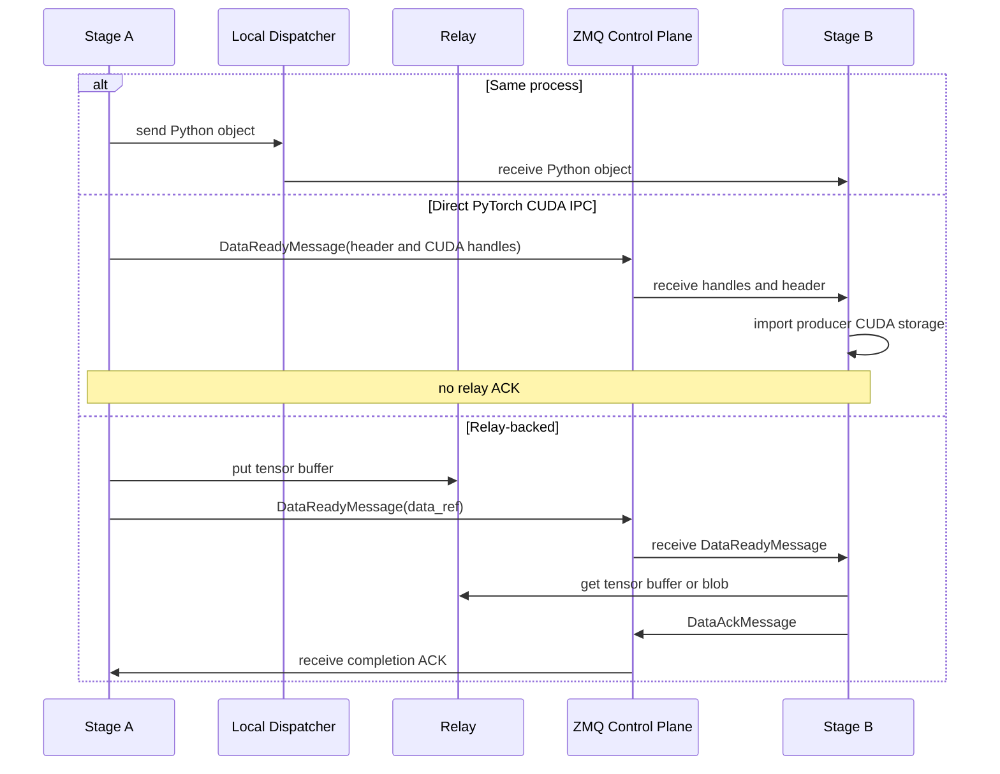

# 通信

在 sglang-omni 中，各阶段（stage）之间的通信由 ZMQ 承载协调信息和序列化的控制元数据，而 `sglang_omni.comm` 负责数据搬运契约。阶段代码按阶段名路由。通信路由器（comm router）会在以下方式之间选择：同进程对象传递、当同部署（same-placement）进程使用兼容的 CUDA 设备序号时的直接 PyTorch CUDA IPC、其他同节点 GPU 边走池化 CUDA IPC、本地 CPU 中转搬运走 SHM、以及已配置的跨节点搬运走 Mooncake。

主要实现入口如下：


| 文件                                            | 角色                                                                  |
| ------------------------------------------------- | ----------------------------------------------------------------------- |
| `sglang_omni/comm/data_ref.py`                  | 由 `DataReadyMessage.data_ref` 携带的带类型中转 `DataRef`          |
| `sglang_omni/comm/router.py`                    | 局部性与传输方式选择                                      |
| `sglang_omni/comm/engine.py`                    | 面向阶段的通信门面                                     |
| `sglang_omni/comm/stage_io.py`                  | 载荷与流式张量的打包/解包                           |
| `sglang_omni/pipeline/control_plane.py`         | ZMQ 套接字、msgpack 序列化、阶段/协调器消息路由 |
| `sglang_omni/pipeline/local_dispatch.py`        | 共置阶段之间的同进程 Python 对象分发          |
| `sglang_omni/relay/base.py`                     | 后端接口与后端注册表                                |
| `sglang_omni/relay/cuda_ipc.py`                 | 发送方持有的 CUDA 池、槽位分配、拷贝与完成通知       |
| `sglang_omni/relay/{shm,nccl,nixl,mooncake}.py` | 具体的中转后端                                               |
| `sglang_omni/proto/messages.py`                 | 控制平面消息类型                                           |

## 传输模型




| 路径                     | 传输方式      | 承载内容                                                                                                      |
| ------------------------ | -------------- | ------------------------------------------------------------------------------------------------------------ |
| 协调             | ZMQ `PUSH/PULL` | `SubmitMessage`、`DataReadyMessage`、`CompleteMessage`、`StreamMessage`、`ShutdownMessage`、profiler 控制 |
| 广播协调   | ZMQ `PUB/SUB`   | `AbortMessage`                                                                                               |
| 同进程搬运    | LOCAL_OBJECT   | 在一个 OS 进程内以 Python 引用传递的完整 `StagePayload` 对象与流式分块                |
| 同部署直接 GPU 搬运 | PyTorch CUDA IPC | CUDA 存储句柄加上普通载荷或流式控制元数据                              |
| 同节点池化 GPU 搬运 | CUDA IPC 中转 | 打包后的载荷张量缓冲区、CUDA 流式分块以及流式元数据张量                         |
| 本地 CPU 中转搬运 | SHM 中转      | 非 CUDA 本地的完整载荷张量缓冲区与流式分块                                        |
| 跨节点搬运      | Mooncake 中转 | 经 Mooncake 选择的传输方式承载的完整载荷张量缓冲区与流式分块                               |

`DataReadyMessage.data_ref` 携带直接 PyTorch CUDA IPC 信封、内联 CPU 流式信封，或带类型的中转 `DataRef`。直接信封包含 pickle 序列化的载荷头或流式元数据，以及 PyTorch CUDA 存储句柄。内联 CPU 流式信封包含一个序列化的张量及其不含张量的元数据。中转 `DataRef` 包含对象 id、数据类别、传输方式、布局、后端缓冲区引用、张量布局以及可选的流式元数据。来自 `RelayOperation.metadata` 的后端私有细节位于 `DataRef.buffer.info` 之下。

## 普通载荷流

协调器把第一个 `StagePayload` 放在 `SubmitMessage` 中直接提交给入口阶段。此后，阶段到阶段的载荷根据边和载荷情况使用 LOCAL_OBJECT、直接 PyTorch CUDA IPC 或中转。

对于直接 CUDA IPC，`Stage` 提取 CUDA 张量叶子，把剩余的 `StagePayload` 作为普通控制元数据 pickle 序列化，并用 PyTorch 的 CUDA 多进程 reducer 序列化每个 CUDA 张量。然后它发送一条包含这些存储句柄的 `DataReadyMessage`。接收方映射生产方的分配并在不经过中转缓冲区的情况下恢复载荷。该路径没有中转 `DataAckMessage`。其生命周期由 PyTorch 的 CUDA IPC 所有权机制承载。

普通的直接载荷头是 ZMQ 控制元数据。它们的大小与池化 CUDA 中转的槽位大小无关，大头部不会被拆分到中转槽位或应用消息中。

对于走中转的载荷：

1. 发送方向 `CommRouter` 请求该边的传输方式并调用
   `CommEngine.send_payload(...)`。
2. 发送 worker 调用 `stage_io.write_payload()`，它会递归地从
   `payload.data` 中提取张量、用占位符替换它们、pickle 序列化不含张量的
   `StagePayload`，并把张量拼接成一个 `uint8` 缓冲区。
3. 发送方对该缓冲区调用 `relay.put_async()` 并发送一条
   `DataReadyMessage(data_ref=...)`，其中包含一个 `DataRef`，带有：
   - `buffer.info`：来自 `RelayOperation.metadata` 的后端特定元数据
   - `header`：base64 编码的不含张量的 `StagePayload`
   - `tensors`：每个张量的路径、形状、dtype、偏移和字节大小
4. 接收方在 `Stage._on_data_ready()` 中处理该消息，调用
   `CommEngine.read_payload()`，等待 `relay.get_async()`，恢复张量，
   并把载荷传递给阶段输入处理器。
5. 接收方发送一条 `DataAckMessage`。发送方随后释放为该逻辑信封保留的
   操作。
6. 如果扇入（fan-in）完成，该阶段把一条 `IncomingMessage` 入队到
   `scheduler.inbox`。

中转载荷格式刻意保持后端中立。后端只需要搬运一个扁平的张量缓冲区，并返回可供另一个后端实例用于 `get_async()` 的元数据。

LOCAL_OBJECT 绕过中转和 ZMQ `DataReadyMessage`：发送方调用进程本地的分发器，后者以投影后的 `StagePayload` 对象本身为目标阶段调用 `receive_local_payload()`。这是直接的 Python 引用传递，不是序列化。接收方必须把载荷、嵌套数据容器、张量、流式分块和元数据视为只读。该对象还必须在接收方调度器队列的生命周期内保持有效。发送方和投影函数不得在分发之后修改或回收对象。

请求和控制对象应保留下游所需的参数，但不应在后续阶段跳转中保留已被消费的大块媒体。把原始媒体转换为规范流水线状态的阶段负责释放这些引用。

对于完整载荷，LOCAL_OBJECT 允许用于单目标的同进程路由。对于扇出（fan-out），只有当每个投影后的载荷都是一个拥有自己 `data` 容器的 `StagePayload` 时才允许使用，这样下游阶段不会共享可变的载荷状态。张量叶子仍可有意识地共享，并且必须被视为只读。

## 流式流程

流式用于生产者-消费者边，例如 thinker 到 talker 的隐藏状态，或 talker 到声码器（vocoder）的 code 张量。阶段层暴露一个发送辅助函数 `CommEngine.send_stream_chunk()`，由路由器选择传输方式。

对于同节点 GPU 目标：

- 同一部署上命名空间兼容的进程可以把 CUDA 分块作为直接 PyTorch CUDA IPC
  信封发送
- 直接流式元数据可以包含 CUDA 张量和普通的内联值，但不能包含 CPU 张量，且直接编解码器（codec）保留单独的 64 KiB 内联元数据准入上限
- 其他同节点 GPU 边使用池化 CUDA IPC 中转
- 一条池化流式 `DataReadyMessage` 携带一个带有
  `transport="cuda_ipc"` 和 `chunk_id` 的 `DataRef`

对于同进程流式目标：

- 阶段通过 `LocalStageDispatcher.send_stream_chunk()` 发送分块
- 接收方以引用方式获得原始 Python 对象和元数据
- 适用与载荷 LOCAL_OBJECT 相同的只读和生命周期注意事项

对于非本地流式目标：

- 序列化后的张量加元数据不超过 16 KiB 且元数据中不含张量的 CPU 张量，
  可以直接搭载在 `DataReadyMessage` 中
- 内联信封拥有自己的字节，因此不需要中转 ACK；超过该上限的分块继续走选定的中转
- 分块用 `write_tensor()` 写入
- 张量值的元数据会被提取并作为独立的 `DataRef` 写入
- 控制消息在等待未完成的 put 操作之前发送
- 接收方在 `Stage._on_stream_chunk()` 中读取 blob 并把一条
  `stream_chunk` 消息入队到 `scheduler.inbox`

先控制后等待的顺序对 NIXL 和其他基于信用（credit）的后端很重要。如果发送方在通知接收方之前等待完成，接收方就永远不会启动那个能释放发送方信用的读取。

流式完成和流式错误是用 `send_stream_signal()` 发送的纯控制消息。

## 中转接口

所有后端都实现 `Relay`：

```python
class Relay:
    async def put_async(
        self, tensor: torch.Tensor, request_id: str | None = None, dst_rank: int | None = None
    ) -> RelayOperation: ...

    async def get_async(
        self, metadata: Any, dest_tensor: torch.Tensor, request_id: str | None = None
    ) -> RelayOperation: ...

    def cleanup(self, request_id: str) -> None: ...
    def close(self) -> None: ...
```

`put_async()` 返回一个 `RelayOperation`，其 `metadata` 会被放入控制消息。put 和 get 操作都暴露 `await wait_for_completion(timeout=...)`。阶段会保持该操作存活，直到可以安全释放该传输。

CUDA IPC 中转拥有一个有界的发送方 GPU 池。其分配粒度默认为 64 KiB，可通过 `cuda_ipc_slot_size_kb` 配置。一个张量可以保留多个连续槽位，但这些槽位仍是一次逻辑传输。发送方发布一条 `DataReadyMessage`，接收方从导出的池范围拷贝，一条逻辑 `DataAckMessage` 释放完整范围。这些槽位是分配器粒度，不是应用层面的分页。

## 传输选择

没有公开的后端选择器。`CommRouter` 从阶段局部性和部署推导传输方式：

| 传输方式 | 选择规则 |
| --- | --- |
| `local_object` | 源阶段和目标阶段共享一个 OS 进程，且该载荷符合直接本地分发的条件。 |
| 直接 PyTorch CUDA IPC | 源和目标共享同一部署、处于不同进程，且运行时能证明进程本地的 CUDA 序号兼容。载荷或流式分块还必须符合直接编解码条件。 |
| `cuda_ipc` | 不使用直接 PyTorch CUDA IPC 的同节点 GPU 边。池化中转支持同 GPU 和跨 GPU 搬运。 |
| `shm` | 所选边不是 GPU 到 GPU 的同节点主机/CPU 传输。 |
| `mooncake` | 列为远程的跨节点阶段边。Mooncake 负责这些传输的协议选择。 |

`CommConfig` 可以按阶段调整槽位大小、信用（credit）和 Mooncake 连接选项。它不选择传输后端。

每个后端只负责传输机制。它不路由请求、不执行扇入、不选择下游阶段，也不解释模型载荷。

## 资源生命周期

阶段层遵循一条简单的所有权规则：

- 发送方写入数据、发送 `DataReadyMessage`，然后在后端要求时等待 put 操作
- 接收方分配目标缓冲区、等待 get 操作、恢复载荷，并调用 `relay.cleanup(request_id)`
- 池化 CUDA IPC 发送方保留其完整槽位范围，直到接收方的一条逻辑 ACK 标记该信封的每个操作都完成
- 直接 PyTorch CUDA IPC 没有中转 ACK，依赖 PyTorch 导入存储的生命周期
- LOCAL_OBJECT 没有后端清理。发送方和接收方共享 Python 对象引用，因此正确性取决于在接收方完成之前只读使用
- 中止从阶段中止路径调用 `relay.cleanup(request_id)`
- 阶段关闭调用 `relay.close()`

后端特定的清理隐藏在该接口之后。例如，`shm` 在接收时取消块链接（unlink），NIXL 和 Mooncake 在完成后释放内存池信用，NCCL 在关闭时拆除进程组。
